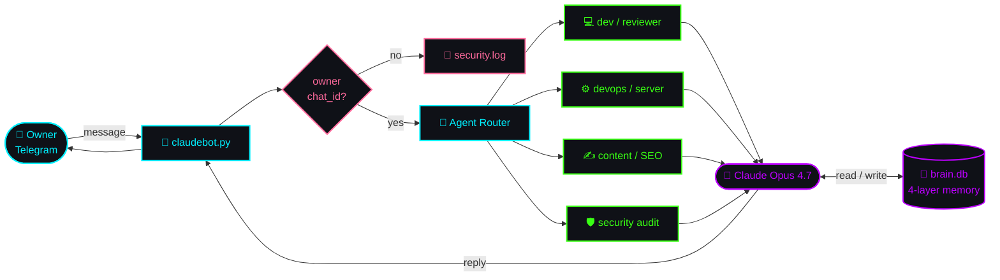

<div align="center">

<a href="https://github.com/yasdelayu">
  
</a>

<br/>


<a href="https://t.me/aiscriipt"></a>


</div>

---

###  &nbsp; `whoami`

```yaml
name:        Maxim
alias:       mmgpro
role:        AI / Automation Engineer
focus:       LLM agents · Telegram bots · Content tooling · Workflow automation
mode:        > freelance projects · long-term contracts · consulting
languages:   Python · TypeScript · Bash
ships:       fast, documented, and actually working
```

> **I build the boring stuff so you don't have to.**
> Custom AI agents, scrapers, parsers, Telegram bots, content pipelines,
> internal tools. Anything that should run by itself — I make it run by itself.

---

###  &nbsp; `services.list()`

<table>
<tr>
<td width="50%" valign="top">

#### `> for_clients/`
- 🤖 **AI agents** on Claude / GPT / open-source models
- 📨 **Telegram bots** — from quick MVP to production
- 🧲 **Parsers & scrapers** — TG, web, marketplaces
- ⚙️ **n8n / Make automations** — wire your tools together
- 📊 **Content pipelines** — generate, post, repurpose
- 🛠️ **Custom internal tools** — dashboards, CRM-lite, ops

</td>
<td width="50%" valign="top">

#### `> for_employers/`
- ✅ Ship-first mindset, no astronaut architecture
- ✅ Comfortable with the full stack — back, front, infra
- ✅ Production AI agents that survive contact with reality
- ✅ Async-friendly, documented PRs, honest standups
- ✅ Russian (native) · English (working proficiency)
- ✅ Available remote · part-time · full-time

</td>
</tr>
</table>

---

###  &nbsp; `stack.dump()`

<p align="center">


<br/>


<br/>


<br/>


</p>

---

###  &nbsp; `agents.deployed()`

> Production AI agents I've built and operate. Not demos — they run 24/7.

<table>
<tr>
<td width="58%" valign="top">

#### 🤖 `JARVIS` &nbsp;·&nbsp; <sub><i>flagship case study</i></sub>

Always-on autonomous agent running on my own Linux box. Wakes on Telegram
messages from a single owner-verified channel, routes tasks to specialist
sub-agents (dev / devops / content / security), holds a 4-layer memory
that survives across sessions, and is hardened against prompt-injection
in the wild.

**Stack:** &nbsp; Claude Opus · Python · SQLite · Telegram Bot API · systemd
**Skills:** &nbsp; persistent memory · agent routing · security audit · code review · content ops
**Uptime:** 24/7 &nbsp;·&nbsp; **Sessions:** continuous &nbsp;·&nbsp; **Access:** owner-only

</td>
<td width="42%" valign="top">

```yaml
agent:    Jarvis
runtime:  Linux + systemd
brain:    Claude Opus 4.7
memory:
  ├─ semantic   (facts)
  ├─ episodic   (events)
  ├─ verbatim   (chunks)
  └─ reflection (patterns)
guards:
  ├─ owner chat_id verify
  ├─ prompt-injection log
  └─ secret redaction
```

</td>
</tr>
</table>

<details open>
<summary><b>🧠 &nbsp; how Jarvis actually thinks — architecture</b></summary>
<br/>



</details>

#### `> other agents in the field/`

| Agent | Job | Channel | Status |
|---|---|---|---|
| 🧾 **Terminator** | summarises group chats · 24h digests · multi-chat | Telegram groups | live |
| 📡 **Claudebot** | owner-only AI controller for the home server | Telegram DM | live |
| 🎬 **Content pipeline** | auto-script · SEO · thumbnail prompts | internal | live |
| 🔒 **Client agents** | custom AI workers · under NDA | private | references on request |

<sub><i>If you need an agent that <b>actually does the job</b> instead of demoing — that's what I build.</i></sub>

---

###  &nbsp; `stats --dump`

<div align="center">


</div>

---

###  &nbsp; `contribution.snake`

<div align="center">
<picture>
  <source media="(prefers-color-scheme: dark)" srcset="https://raw.githubusercontent.com/yasdelayu/yasdelayu/output/github-snake-dark.svg"/>
  <source media="(prefers-color-scheme: light)" srcset="https://raw.githubusercontent.com/yasdelayu/yasdelayu/output/github-snake.svg"/>
  
</picture>
</div>

---

###  &nbsp; `let's build something`

<div align="center">

<b>Looking for an engineer who ships? Got an idea that needs to become a product?</b>
<br/>
<b>I'm one message away.</b>
<br/><br/>

<a href="https://t.me/aiscriipt">
  
</a>
<a href="https://t.me/mmgpro">
  
</a>

<br/><br/>

<sub><i>more channels arriving soon</i></sub>

</div>


